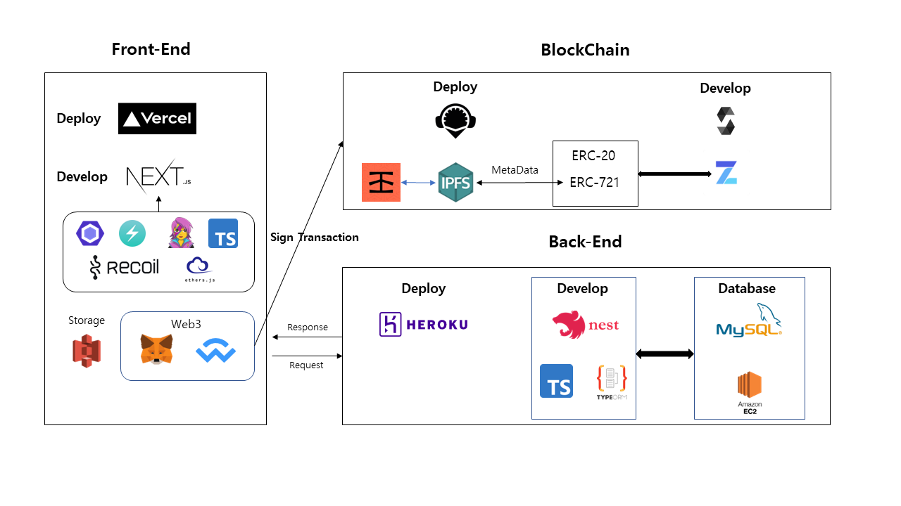
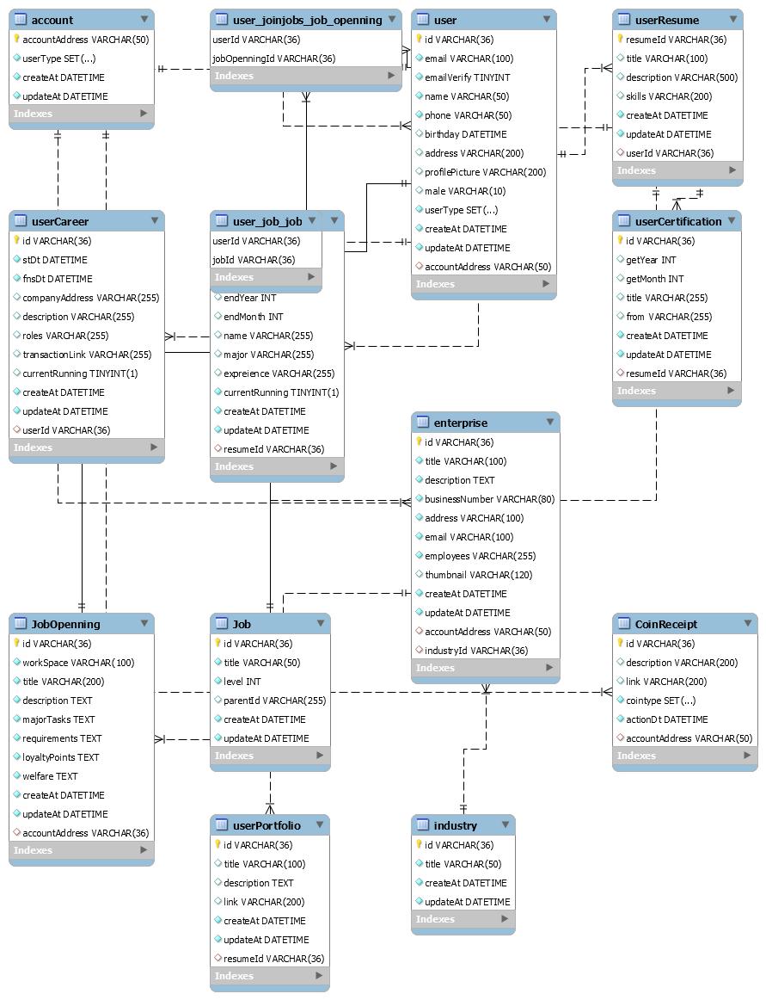

## OpenSource / document

> BackEnd github - https://github.com/LimChaeJune/Block-Jobs-API  
> Contract github - https://github.com/LimChaeJune/Contracts  
> Notion Page - https://ruddy-lightyear-95b.notion.site/BlockJobs-334590e6441e40ef984c3d26aede53b9

## Contract Address (Rinkeby TestNet)

### BlockJobs

0x5aD2765319620bab2777c3E23F47145113818530

### BlockJobsCoin

0x58BB470CF9d85fe769A2DA244FC8B4039A1C86d1

### BlockJobsNFT

0xd6310A71d1241970E0a61041C124D663FD24822F

---

# [BlockJobs](https://block-jobs.vercel.app/) 소개

현재 개발자 혹은 디자이너 등 프리랜서와 외주 등의 근무자는 회사가 사라진 경우 혹은 경력을 증명해주는 기관이 사라진다면, 이후의 경력을 증빙하기 쉽지 않습니다.
(예를 들어 `KOSA` 등의 경력 인증 사이트는 경력 신청, 경력 증명서 출력시 매번 수수료를 지불하고 해야하며 개인의 편차지만, 그 가격이 전혀 저렴하지 않습니다.)
BlockJobs는 Ethereum Smart Contract 로 인해 기업과 근로자가 서로 경력을 증명하고 블록체인 네트워크의 불변성으로 경력 조작을 방지하고, 경력 한번 등록 이후엔 수수료를 부과하지 않는 오픈소스 Dapp입니다.

각 사용자는 아래와 같은 보상을 가져갈 수 있습니다.

## 근로자

근로자는 블록체인 네트워크의 불변성으로 경력 조작을 방지하고, 경력 등록 시 지불하는 (GasFee + 소량의 BJC 토큰) 외에는 조회는 네트워크를 통해 별도의 비용없이 조회할 수 있습니다.

## 기업

기업의 경우는 경력을 인증함으로서 등록자가 지불하는 BJC 토큰을 얻게되고, BJC 토큰을 이용해 채용 시에 (이력서 열람, 헤드헌팅, 오퍼) 등의 이익을 가져갈 수 있고, 다른 기업들에 의해 검증된 경력자를 채용할 수 있습니다.

---

# Token Economy

## BJC (ERC-20) 토큰

BJC 토큰은 블록을 생성하지 않기 때문에 이더리움을 이용한 swap 혹은 Dapp 활동을 통한 인센티브로만 토큰을 할당하게 됩니다.

- 발행량: 10000000 \* decimal(18)
- 가치: BJC = ETH(0.00001)

BJC는 `소비`와 `수입`은 아래와 같은 구조를 가집니다.

- BJC 할당 및 수입

  - 토큰 스왑 (기업, 근로자)
  - 경력 확인 (기업)
  - 기업 리뷰 작성 (근로자)
  - 채용 공고 (기업) - TODO
  - 오퍼 (근로자) - TODO

- BJC 소비
  - 경력 신청 (근로자)
  - 이력서 열람 (기업) - TODO
  - 채용 공고 - 이력서 제출 (근로자) - TODO
  - 헤드헌팅 / 오퍼 (기업) - TODO
  - 리뷰 열람 - TODO

### 토큰 스왑

0.00001 ETH로 1 BJC로 스왑이 가능하며, 현재 BJC에서 ETH는 Dapp상 구현이 되어있지 않습니다. (Contract로는 배포되어있음)

### 경력 신청 / 확인

경럭 증명 신청시에 `신청자 10 BJC 소비` Contract 관리자에게 들어가게 됨 그 후 기업이 신청 확인 후 `승인` 시엔 8 BJC(80%)를 배분받고 2 BJC(20%)는 Contract 관리자에게 배분됨 `거절` 시엔 신청자에게 5 BJC (50%)가 되돌려지고, 나머지는 기업이 가지게 됨

### 기업 리뷰 작성

경력을 증명받은 기업에 리뷰를 작성함으로서 `5 BJC`를 부여받는다. 작성한 리뷰는 NFT로 발행할 수 있다.

## BJN (ERC-721) NFT 토큰

NFT 토큰은 리뷰를 작성한 후에 NFT 발행 버튼을 통해 발행할 수 있으며, Metadata로는 `제목 / 내용 / 캡쳐 이미지`가 올라가게 된다.
발행된 NFT는 etherscan과 [Opensea](https://testnets.opensea.io/collection/blockjobs)에서 확인이 가능하며, BlockJobs에서는 발행까지만 지원하며 거래 혹은 재화의 가치를 가지지 않는다.

---

# Skills

## Architecture

## Front-end

- `Next.js`의 SSG, SSR을 사용해 사용자와 상호작용하는 웹 페이지를 구현했습니다.

- `Typescript`로 빌드 시 오류를 미리 찾고, 코드의 안전성을 높였으며, typeorm을 사용하는 nestjs와 수월하게 API를 상호작용하였습니다.

- `Ethers.js`을 사용해 Web3, Contract와 상호작용 하였습니다.

- `Recoil`로 State를 관리했습니다.

- `Emotion/ChakraUI`을 사용해 자바스크립트로 스타일을 관리하며, ChakraUI를 사용해 개발의 생산성을 높였습니다.

- `ESLint/Prettier`을 사용해 코드의 일관성을 지켰으며, 빌드 시에 안쓰는 코드를 수정할 수 있게 안전성을 높였습니다.

## Back-end

- `Nest.js`로 웹 어플리케이션 서버를 구축했습니다.
- `TypeORM`으로 DB와 통신하여 OOP 형식으로 데이터 로직을 작성했습니다.
- `Swagger`로 작성한 API문서를 작성했습니다.

## BlockChain

- `Solidity`로 Smart Contract를 작성했습니다.
- `OpenZepplin`의 인터페이스(ERC-20, ERC-721)을 기반으로 개발했습니다.
- `Remix`로 소스를 컴파일하고, Web3에 컨트랙트를 배포했습니다.
- `IPFS`에 분산 저장된 데이터와 상호작용합니다.

## Infra Structure

### CI/CD

- `Vercel`로 프론트엔드 코드의 배포를 진행했습니다.
- `Heroku`로 백엔드 코드의 배포를 진행했습니다.

## DB

- `EC2`를 사용해 DB 서버를 구축했습니다.
- `MySql`을 데이터베이스로 사용했습니다.
